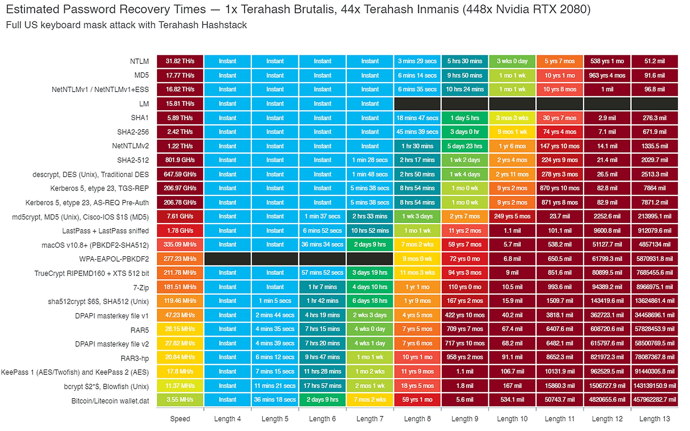

# Build and Learn Rails Authentication
### Ryo Kajiwara (sylph01)
### 2021/10/21 @ Kaigi on Rails 2021

----

# 本発表のレポジトリは以下です
## スライドはslidesフォルダ以下にあります

----

# 誰？

- sylph01 / 梶原 龍
- Twitter: @s01
- 暗号とかできます
- Elixirとかできます
- Railsまるでわからん

----

# Rails(鉄道)にはよく乗ります

----

# 若干真面目な自己紹介

- やせいのプログラマ(要するにフリーランス)
- W3C, IETFなどでセキュリティ寄りのプロトコルの標準化のお手伝いをしていました
    - HTTPS in Local Network, Messaging Layer Securityなど
- 次世代OAuthの薄い本を書きました
    - 現バージョンは今は頒布中止していますが新バージョン出したい
- Kaigi on Rails 1週間前に松山に引っ越しました

----

# 現場の宣伝

- 株式会社コードタクトにて「まなびポケット」の認証認可基盤の開発をしています
- 認証認可チームにて**新規メンバーを募集中です**
    - 既存の認証基盤を置き換える新規開発を行います
    - モダンな認証認可技術で日本の公教育にイノベーションをもたらしましょう

----

----

# Railsの認証？

# 要するに**Devise**のことでしょ？

----

# なんか強い人から

# Deviseは**イケてない**って聞いたんだけど？

----

# Rails sucks? It's most likely that **you suck**

# Devise sucks? It's most likely that **you suck**

----

# 本発表の目的

認証機能の自作と解説、また主要な認証ライブラリのアプローチの比較を通して、

**認証技術への理解を深めること、また認証ライブラリの選択を手助けすること**

を目指します

----

# Disclaimer

- Do try this at home, but
- **Do not try this in production**

できる限り脆弱性を埋め込まないように気をつけて作ることをしますが、通常の場合productionでは**多数の人によって検証されているライブラリを使用すること**をおすすめします。

----

# Disclaimer (2)

なんなら **認証機能は自分で持たないほうがいい。**

- 自分でIDを管理するのは飲水を確保するのに自分で井戸を掘ること
- ID連携技術を使ってIdPを利用することは近代的な水道インフラに乗っかること

**OAuth/OpenID Connect**の話もできるにはできますが今回はその話はしません。

----

----

# 第1部:

# 認証を作ってみる

----

# 認証/認可についての概念

人は対象をどのように認知するか？

- 人/システムは **対象(Entity)** を直接認知しない。
- 人/システムは **Identity(属性の集合)** を通して対象(Entity)を認知する。
- 1つの対象(Entity)は複数の属性(Identity)を持ち、文脈に応じて使い分ける。

----

# 認証/認可についての概念

- Authentication(認証)
    - Entityがサービスの認知するIdentityに紐付いているという確証を得ること
    - 一般にいう「ログイン機能」は、識別子(ID)とパスワードの組を提示できることによって、 **利用するEntityがサービス上のEntityに対応している**という確証を得られることによって成立する
- Authorization(認可)
    - リソースにアクセスするための条件を定めること

----

# Webサービスの認証で必要な機能

- 必ず欲しい
  - ログイン・ログアウト
  - クッキーからの自動再ログイン(remember)
  - パスワードリセット
- できれば欲しい
  - ロックアウト
  - Eメール認証
  - ワンタイムパスワード

(機能はDeviseやRodauthのfeaturesから抜粋)

----

# パスワード認証に対する攻撃

パスワード認証に対する攻撃は一般に

- ブルートフォース攻撃
    - 辞書攻撃もこれの亜種
- **データベース流出を利用したハッシュクラック**
    - ローカルで大量にハッシュ計算して衝突させる
    - なお、「暗号化して保存」では復元できてしまうのでダメです

の2つの形を取る。

----

# ハッシュアルゴリズムの選択

パスワードを保存する場合のハッシュアルゴリズムは**遅いものほどよい**。この理由は**正規のハッシュは1回しか計算されないが攻撃の際は複数のハッシュを計算しなくてはいけない**ため。

（詳細は省略、キーワードで検索してください）

- MD5: 伸長攻撃が可能、そもそもハッシュ長が短いので衝突させやすい
- SHA-1: 強衝突耐性が突破されている
- SHA-2: 衝突耐性の面では現時点では十分だが、計算が十分に遅くない
    - 複数回適用して遅くするPBKDF2という方式がある
- パスワードハッシュ用に開発された**bcrypt**はわざと計算を遅くしている

<!--
https://twitter.com/TerahashCorp/status/1155128018156892160
https://qiita.com/ockeghem/items/5a5e73528eb0ee055428
-->

----

(https://twitter.com/TerahashCorp/status/1155128018156892160 より)

bcryptなら8桁でもクラックするのにGPUクラスタでも**18年かかる！**

----

# salt

ユーザーごとにランダムな文字列sを生成し、ハッシュ値の $h(p || s)$ と平文の s を保存することによって、事前にハッシュを計算しておいてテーブルをルックアップする**レインボーテーブルアタック**を回避できる。

bcryptでは出力される文字列がsaltとハッシュ値の組を結合したものになっている。

----

# `has_secure_password`

Railsでは `has_secure_password` というモデルのメソッドがbcryptを利用してパスワードハッシュ化の面倒を見てくれる。

ソースは `activemodel/lib/active_model/secure_password.rb` 。

----

# 応用

攻撃者が正解のハッシュ値を得られないようにすればよいので、もっとがんばるなら以下のような方法が取れる:

- HMAC-SHA256のsecretを外部のHardware Security Moduleに保存して、HSMのAPIを通してハッシュ計算をする
    - secretはHSM上にしかないので、ハッシュ値の計算がHSMにしかできなくなる
- ハッシュ値そのもののアクセスを可能な限りさせないためにデータベース関数を利用する
    - 後で紹介する rodauth がこの方式を使っている

----

# クッキーからの自動再ログイン、パスワードリセット、Eメール認証

基本的に原理は同じで、

- 有効期限つきの乱数列を払い出しユーザーモデルに関連づける
    - 乱数列が利用される際には有効期限を確認、利用されたら乱数列を破棄
- Eメール認証とパスワードリセットではこの乱数列を登録しているメールアドレスに対して送信する

すべて同様に **「生成した乱数列を知っていて」「有効期限内で提示できる」** という性質をもってEntityが登録ユーザーに対応することを確認している。

----

# クッキーからの自動再ログイン？セッションじゃダメなの？

----

# ワンタイムパスワード

- [HOTP: An HMAC-Based One-Time Password Algorithm (RFC 4226)](https://datatracker.ietf.org/doc/html/rfc4226)
- [TOTP: Time-Based One-Time Password Algorithm (RFC 6238)](https://datatracker.ietf.org/doc/html/rfc6238)

を用いるものが一般的。

**サーバーと共通の秘密を知っていて、共通の秘密から時刻などに基づいて特定の値を導出できる** という性質をもってEntityが登録ユーザーに対応することを確認している。

----

# ロックアウト(ブルートフォース攻撃対策)

- 以下の性質を持つカウンタを用意
    - 不正なログイン試行でカウントが1増えて
    - 正常なログインで0に戻る
- 一定以上のカウントを持っている場合、最終ログイン時間から一定時間が経過していない場合パスワードがあっていても自動的にログインに失敗する
    - 試行回数に対して指数でログイン不可能時間を設ける[exponential backoff algorithm](https://devcentral.f5.com/s/articles/implementing-the-exponential-backoff-algorithm-to-thwart-dictionary-attacks)という方式が一般的

----

# 実際に作ってみた

`https://github.com/sylph01/touch-and-learn-authentication/`

以下のRailsアプリにこれらの欲しい機能をできるだけプリミティブに実装したサンプルを置いています。

----

----

# 第2部:

# 認証ライブラリの話

----

# (再掲)

# Railsの認証？

# 要するに**Devise**のことでしょ？

----

# 何でライブラリが欲しいか

- ~~楽をしたい~~
- Railsのイディオムに沿った形で認証機能を使いたい
- いろんな人の目が入ってるのでセキュリティバグを埋め込んでいる可能性が少ない

----

# 何でライブラリがあるのに自作をしたか

- 今回は学習目的
- productionでも一度自作している
    - ユーザーインターフェースを伴わないJSON APIで、アクセストークンを払い出す機構だけが欲しかった
    - 一般にproductionでライブラリを使わない理由があるとすれば**目的に合致しないから**

----

# ライブラリの比較

- [Devise](https://github.com/heartcombo/devise)
- [Sorcery](https://github.com/Sorcery/sorcery)
- [Authlogic](https://github.com/binarylogic/authlogic)
- [Rodauth](https://github.com/jeremyevans/rodauth)

を対象に比較をしていきます。
