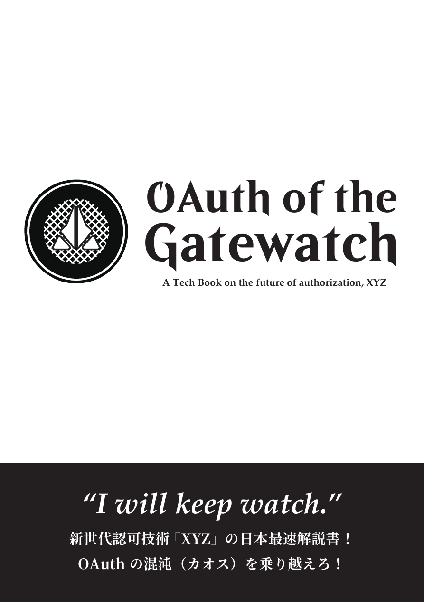

# Touch and Learn Rails Authentication
### Ryo Kajiwara (sylph01)
### 2021/10/21 @ Kaigi on Rails 2021

----

# 誰？

- sylph01 / 梶原 龍
- Twitter: @s01
- 暗号とかできます
- Elixirとかできます
- Railsまるでわからん

----

# Rails(鉄道)にはよく乗ります

----

# 若干真面目な自己紹介

- やせいのプログラマ
    - 要するにフリーランスです
- W3C, IETFなどでセキュリティ寄りのプロトコルの標準化のお手伝いをしていました
    - HTTPS in Local Network, Messaging Layer Securityなど
- 次世代OAuthの薄い本を書きました
    - 現バージョンは今は頒布中止していますが新バージョン出したい

----

# 現場の宣伝

(右側に画像を入れる、QRコードとかあるといい？)

- 株式会社コードタクトにて認証認可基盤の開発をしています
- 認証認可チームにて**新規メンバーを募集中です**
    - 既存の認証基盤を置き換える新規開発を行います
    - モダンな認証認可技術で日本の公教育にイノベーションをもたらしましょう

----

----

# Railsの認証？

# 要するに**Devise**のことでしょ？

----

# なんか強い人から

# Deviseは**イケてない**って聞いたんだけど？

----

# Rails sucks? It's most likely that **you suck**

----

# Devise sucks? It's most likely that **you suck**

----

# 本発表の目的

認証機能の自作と解説、また主要な認証ライブラリのアプローチの比較を通して、

**認証技術への理解を深めること、また認証ライブラリの選択を手助けすること**

を目指します

----

# Disclaimer

- Do try this at home, but
- **Do not try this in production**

できる限り脆弱性を埋め込まないように気をつけて作ることをしますが、通常の場合productionでは**多数の人によって検証されているライブラリを使用すること**をおすすめします。

----

# Disclaimer (2)

なんなら **認証機能は自分で持たないほうがいい。**

- 自分でIDを管理するのは飲水を確保するのに自分で井戸を掘ること
- ID連携技術を使ってIdPを利用することは近代的な水道インフラに乗っかること

**OAuth/OpenID Connect**の話もできるにはできますが今回はその話はしません。

----

----

# 必要な機能

- 必ず欲しい
  - ログイン・ログアウト
  - クッキーからの再ログイン(remember)
  - パスワードリセット
- できれば欲しい
  - ロックアウト
  - Eメール認証
  - ワンタイムパスワード

----
